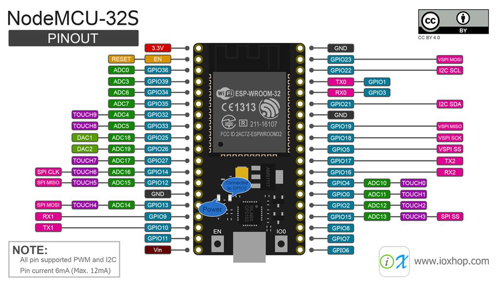
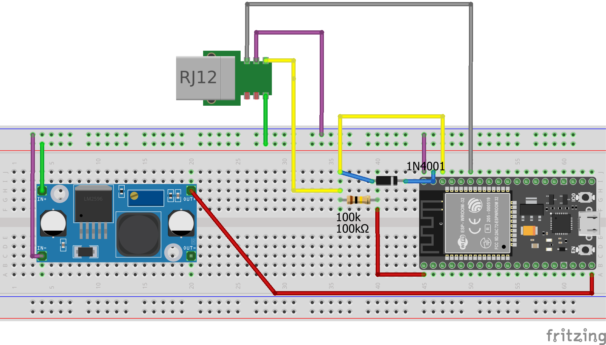
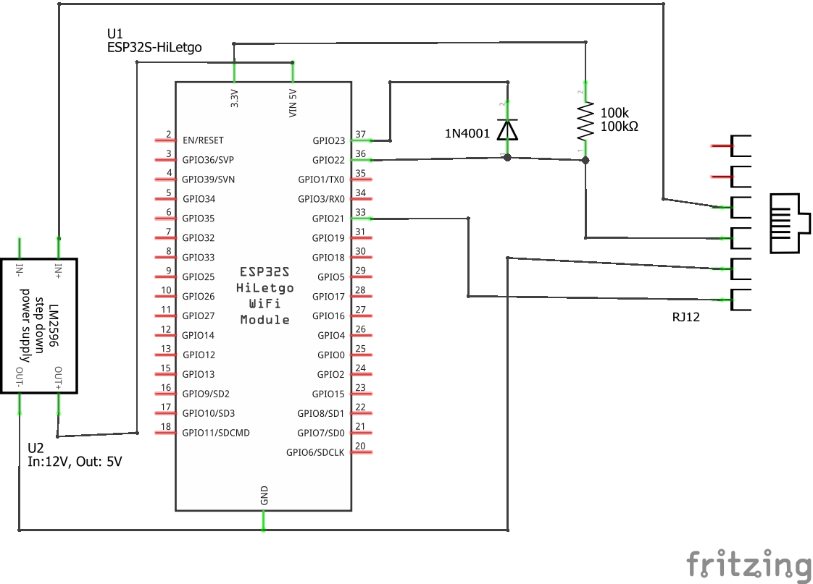

## Cómo hacer tu propio ESPSkyPortalModule (una alternativa económica al módulo Wifi SkyPortal de Celestron)

Este pequeño proyecto nació con la inspiración de encontrar una alternativa más económica al módulo Wifi SkyPortal de Celestron para monturas NexStar Goto. Con un precio de 150 € por un dispositivo tan sencillo, habría sido una locura no intentarlo nosotros mismos. Al final, sin embargo, no esperaba tantos problemas para lograr que se comunicara correctamente, pero ahora todo funciona bien y quiero compartirlo con ustedes.

Si te gusta este proyecto, puedes invitarme a una cerveza. ¡Salud!

[](https://www.paypal.com/donate/?hosted_button_id=H9MLT8Z9DL7YN)

### Materiales necesarios:

- ESP32, el económico "NodeMCU32" (consulta el diagrama de pines para obtener el que usé; hay diferentes versiones y no sé si todas funcionan correctamente)
- Resistencia de 50k-100k (usé exactamente 93k ohmios, ~2x46k)
- Un diodo (1N4001, pero cualquier otro debería servir)
- Un pequeño convertidor reductor de voltaje, para obtener 5V a partir de 12V
- Un cable RJ12 para conectar el dispositivo
- (Opcional) una carcasa o caja para protegerlo

### Pines que debemos conectar desde el cable RJ12 de 6 pines:
- PIN3 verde - 12V (al módulo reductor)
- PIN4 amarillo - datos (al TXPIN, RXPIN y 3.3v)
- PIN5 rosa - tierra/masa (a cada gnd)
- PIN6 gris/negro - selección (al SELPIN)

Conecta el pin TX al pin de datos mediante el diodo. TX solo activará la línea a nivel bajo, y necesitamos evitar un conflicto de señal en nivel alto. (Si el dispositivo NexStar jala la línea a bajo nivel, esta salida TX podría mantenerla en alto.)
Conecta el pin RX directamente al pin de datos.
```
3.3v --[100k]--+
TXPIN ----<|---+--Data Pin 
RXPIN ---------+
```
Conecta una resistencia de 40k-50k entre 3.3v y el pin de datos. (un pull-up débil, ya que TX ya no puede activar la línea a alto nivel y la señal se elevaría lentamente en la transición TX Bajo -> TX Alto)

Conecta el SELPIN directamente al pin de selección en el RJ12.





### ¿5V = 3.3V?
Y sí, conectamos nuestros pines E/S de 3.3V del ESP32 a una línea con un potencial de 5V. Probé algunos convertidores de nivel 3V/5V, pero siempre hay problemas en la conversión de niveles.
Por lo tanto, la señal del NexStar ya no es legible. Luego me di cuenta de que el mando a mano (Handcontrol) envía a 5V, pero la placa principal responde con un nivel de 3.3V.
Los de Celestron conectaron directamente la lógica de 5V y 3.3V. No es el mejor comienzo, pero pensé que podríamos hacer lo mismo para este proyecto, y funcionó todo perfectamente.
Lo único que podría fundirse es nuestro ESP32, el cual es barato.
(¡Pero aún así sugiero evitar esto en el desarrollo profesional de productos!)

El dispositivo se anuncia a sí mismo mediante la difusión de su versión de firmware y su dirección MAC.
El software de control se conecta al puerto TCP 2000 en la IP 1.2.3.4 si el dispositivo está en modo AP.
Existe un protocolo especial, pero todo lo que necesitamos hacer es determinar cuándo un mensaje está completo, ya que la longitud de un mensaje puede variar. 
Una vez que recibimos un mensaje en el flujo TCP, lo reenviamos vía proxy a la interfaz serial y viceversa.

### Lista de tareas (ToDo-List)

- [x] implementar proxy AUX de Celestron
- [x] implementar modo punto de acceso (AP)
- [ ] hacer funcionar la configuración de WiFi con WiFi en modo cliente

El dongle original puede conectarse a una red WiFi existente, una vez que se configura mediante el software.
Para esta conexión, el software se conecta a una especie de interfaz Telnet en el puerto 3000.

Esta es una comunicación que capturé mientras configuraba el módulo original, para conectarme a mi WiFi con el nombre Special"Character"WifiName (NX es un mensaje del NexStar, PC es mi ordenador, [0x0d 0x0a] es simplemente un carácter de nueva línea):
```
NX:"> "
PC:"get wlan.ssid[0x0d 0x0a]"
NX:Wifiname[0x0d 0x0a]
NX:"> "
...now there are more commands like the one above...
PC:"set wlan.ssid "Special"Character"WifiName"[0x0d 0x0a]"
NX:"Set OK[0x0d 0x0a]"
NX:"> "
...now there are more commands like the one above...
PC:"save[0x0d 0x0a]"
NX:"Success[0x0d 0x0a]"
NX:"> "
```
Esto es parte de ZentriOS (de Silicon Labs) y es efectivamente un servidor Telnet completo con mucha más funcionalidad.

Comandos necesarios (set y get):

```
set wlan.ssid "ssidname"
set wlan.passkey "mypassword123"
set wlan.static.netmask 0.0.0.0
set wlan.static.ip 0.0.0.0
set wlan.static.gateway 0.0.0.0
set wlan.dhcp.enabled 1
```
Actualmente no estoy interesado en desarrollar un servidor Telnet falso y, dado que para mí no hay necesidad de usar una red WiFi existente, mi digitalRead(motivation) devuelve LOW. Pero si alguien necesita esto, no dudes en contactarme.

El ESP32 está disponible en una red "segura" con el nombre Celestron-F7F y la contraseña 123456789, la cual se puede cambiar en el código.
