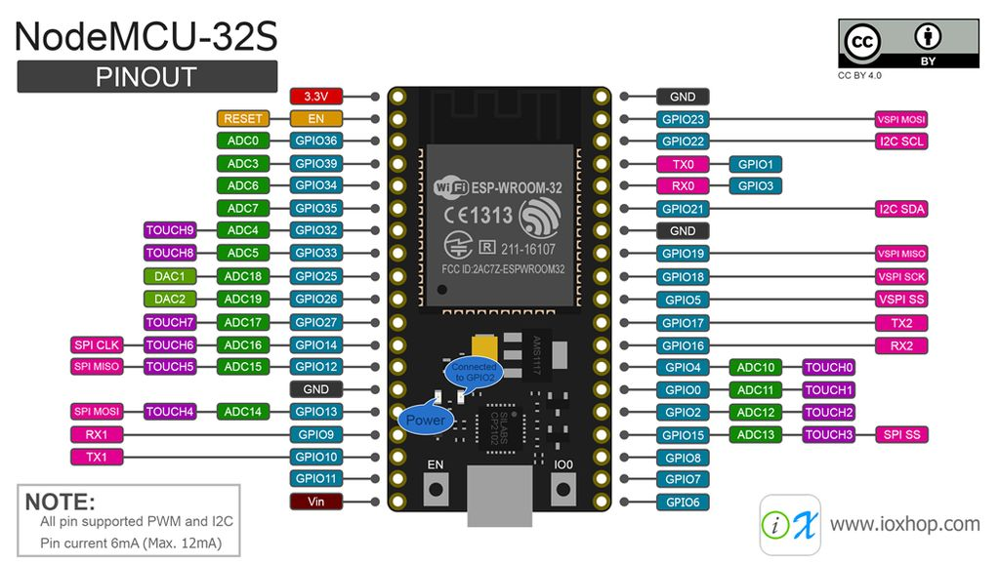
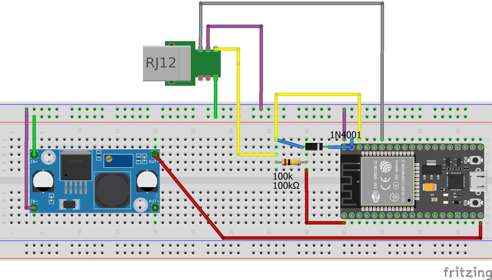
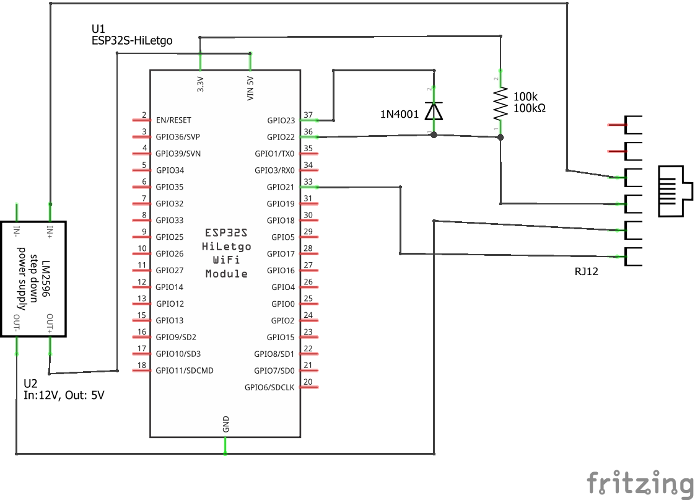

## How to make your own ESPSkyPortalModule (a cheap Celestron SkyPortal Wifi-Module alternative)

This little project was inspired by finding a cheaper alternative to the Celestron SkyPortal Wifi Module for NexStar Goto Mounts. With 150€ for such a simple device, it would be crazy not to try and do it ourself. At the end tho, I did not expect that many problems with getting it to communicate correctly, but now it all works fine and I want to share it with you.

If you like this project, you can buy me a beer. Cheers!

[](https://www.paypal.com/donate/?hosted_button_id=H9MLT8Z9DL7YN)

### needed stuff:

- ESP32, the cheap "NodeMCU32" (see pinout to get the one I used, there are diffrent versions idk if every version works fine)
- 50k-100k resistor (i used exactly 93k ohm, ~2x46k)
- a diode (1N4001, but any other should be ok)
- a small step down converter, to get 5V out of 12V
- RJ12 cable to plug in the device
- (optional) a case or box to protect it

### Pins we need to connect from the 6-pin RJ12 cable:
- PIN3 green - 12V (to step-down module)
- PIN4 yellow - data (to TXPIN, RXPIN and 3.3v)
- PIN5 pink - ground (to every gnd)
- PIN6 gray/black - select (to SELPIN)

Connect the TX pin to the data pin via the diode. TX will just pull the line down, and we need to prevent a high-override. (If Nexstar Device pulls down, this TX output could keep the line high.)
Connect RX Pin directly to the data pin.
```
3.3v --[100k]--+
TXPIN ----<|---+--Data Pin 
RXPIN ---------+
```
Connect a 40k-50k resistor between 3.3v and Data Pin. (a weak pullup, since TX can't pull up anymore and the signal would rise slowly on TX Down -> TX High transition)

Connect the SELPIN directly to the select pin on the RJ12.





### 5V = 3.3V ?
And yes, we connect our 3.3V IO pins from ESP32 to a potential 5V line. I tried some 3V/5V converters but there are always problems in level shifting.
So the signal from the NexStar is not readable anymore. Then I realized that the Handcontrol is sending at 5V, but the mainboard is responding with a 3.3V level.
The guys from Celestron directly connected 5V and 3.3V logic. Not a good start, but I guessd we could do the same for this project - and it all worked fine.
The only thing that could get grilled is our ESP32, which is cheap.
(But I would still suggest to avoid this in professional product development!)

The device advertises itself via broadcasting its firmware version and mac address.
The control software connects to a tcp port 2000 on ip 1.2.3.4 if the device is in AP mode.
There is a special protocol, but all we need to do is to figure out when a message is complete, since the length of a message can vary. 
After we got a message in the tcp stream, we proxy it to the serial interface and vice versa.

### ToDo-List

- [x] implement Celestron AUX proxy
- [x] implement access-point mode
- [ ] get wifi config with wifi in client-mode working

The original dongle can connect to an existing wifi, after it is configured via the software.
For this connection the software connects to a sort of telnet interface on port 3000.

This is a communication that I sniffed while configuring the original module, to connect to my Wifi with the name Special"Character"WifiName (NX is a message from NexStar, PC is my PC, [0x0d 0x0a] is just a next-line-character):
```
NX:"> "
PC:"get wlan.ssid[0x0d 0x0a]"
NX:Wifiname[0x0d 0x0a]
NX:"> "
...now there are more commands like the one above...
PC:"set wlan.ssid "Special"Character"WifiName"[0x0d 0x0a]"
NX:"Set OK[0x0d 0x0a]"
NX:"> "
...now there are more commands like the one above...
PC:"save[0x0d 0x0a]"
NX:"Success[0x0d 0x0a]"
NX:"> "
```
This is part of ZentriOS (by Silicon Labs) and is indeed a full telnet server with much more functionality.

Commands needed (set and get):

```
set wlan.ssid "ssidname"
set wlan.passkey "mypassword123"
set wlan.static.netmask 0.0.0.0
set wlan.static.ip 0.0.0.0
set wlan.static.gateway 0.0.0.0
set wlan.dhcp.enabled 1
```
Currently I'm not into developing a fake telnet server and since for me there is no need to use an existing wifi, my digitalRead(motivation) returns LOW. But if someone needs this, feel free to contact me.

The ESP32 is available in a "secured" network with the name Celestron-F7F and the password 123456789, which can be changed in the code.
